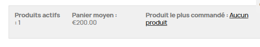

# Module Itrmanagecontent 

---

## 1. Mise en place initiale  
- **Création du squelette du module**  
  - Fichiers de base (`itrmanagecontent.php`, `install.php`, `uninstall.php`, dossier `views/…`)  
  - Enregistrement des hooks essentiels (`header`, `displayBackOfficeHeader`, `displayHome`, `displayTop`, `displayFooterProduct`, ...) 

---

## 2. Bloc HTML pour les visiteurs et les utilisateurs connectes
   - affichage back office en utilisant "getConfigForm()"
   
   - affichage front office en utilisant "hookDisplayHome()"
   


---

## 3. Statistiques sur le back office  
- affichage des statistiques en utilisant "getContent()" en appelant "renderStats()" pour afficher :  
     - Clients actifs  
     - Commandes validées  
     - Total des ventes  
    
    


---

## 4. Statistiques sur le front office  
- affichage des statistiques en utilisant "hookDisplayHome()" pour afficher :
    - Le nombre de produits total actifs sur le site
    - Le prix du panier moyen
    - Lien vers le produit le plus commandé

    


## Où je suis arrivé :

## 4. Signalement d’erreur produit (feature AJAX)  
Signalement d’erreur produit  
- Bouton “Signaler une erreur” sur fiche produit (`displayFooterProduct`)  
- Modal AJAX pour poster un message sans rechargement  
- Sauvegarde en base + envoi de mail à l’administration  

J’ai rencontré des difficultés, notamment pour lier correctement le bouton à la fenêtre modale d’envoi de message, ce qui m’a empêché d’achever cette fonctionnalité.

---

# Ce qu’il reste à finaliser

**Fonctionnalités “Avatar”** 
   - Sélection d’avatars dans la fiche client  
   - Affichage sur la page d’accueil :  
     ```
     Bonjour {Prénom} {Avatar}
     ```

---

## Perspectives d’évolution  
- Restylage CSS 
- Recherche / filtrage en temps réel dans l’historique  
- Catégorisation des signalements
  Ajouter un champ « type d’erreur » (description, prix, image) pour mieux filtrer et traiter.

